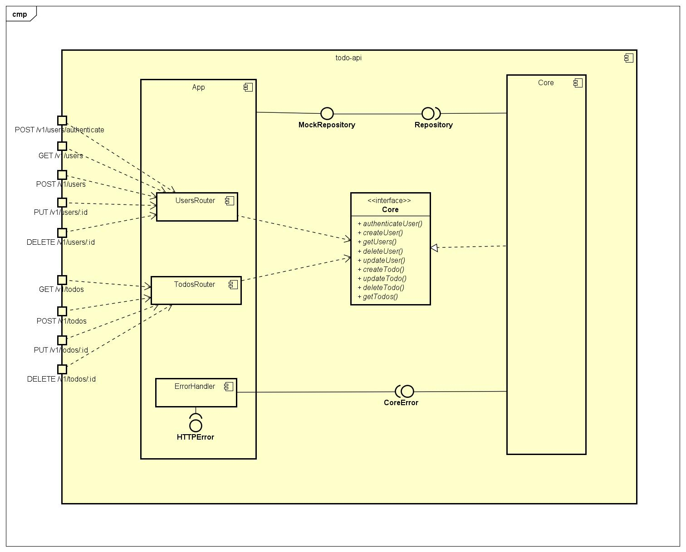
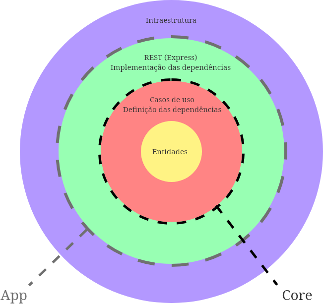

## Estrutura do projeto

Para o projeto do teste, utilizamos 3 conceitos principais também utilizados em algumas das aplicações desenvolvidas na empresa:

### [Programação Funcional](https://pt.wikipedia.org/wiki/Programa%C3%A7%C3%A3o_funcional)

Paradigma de programação que utiliza funções previsíveis como coração do código, facilitando teste e reutilização de código, aproveitando-se do fato de que funções são a base de das linguagem de programação no geral.

#### Exemplo

Diferença entre um caso de uso implementado com Programação Orientada a Objetos e com Programação Funcional

```typescript
// Orientado à Objetos

class GetUsersUseCase {
  constructor(private userRepository: Repository<User>) {}
  
  async execute(authTokenData: AuthTokenData | undefined): Promise<User[]> {
    // ...
  }
}

// Utilização

const getUsersUseCase = new GetUsersUseCase(userRepository)

const users = await getUsersUseCase.execute(authToken)
```

```typescript
// Funcional

const getUsers = (userRepository: Repository<User>) => async (
  authTokenData: AuthTokenData | undefined
): Promise<User[]> => {
  // ...
}

// Utilização

const getUsersUseCase = getUsers(userRepository)

const users = await getUsersUseCase(authToken)
```

### [Clean Architecture](https://blog.cleancoder.com/uncle-bob/2012/08/13/the-clean-architecture.html)

Modelo arquitetural que visa encapsular as regras de negócio, separando-as da implementação de frameworks específicos, aumentando a testabilidade e a coesão e diminuindo acoplamento.




#### Exemplo:

Criação do caso de uso e da entidade na camada `Core`

```typescript
// src/core/entities/User.ts

export interface User {
  readonly id: string
  name: string
  email: string
  password: string
}

export const User = ({ name, email, password }: UserData): User => ({
  id: v4(),
  name,
  email,
  password: hashPassword(password)
})
```

```typescript
// src/core/usecases/getUsers.ts

export const getUsers = (userRepository: Repository<User>) => async (
  authTokenData: AuthTokenData | undefined
): Promise<User[]> => {
  if (!authTokenData) {
    throw PermissionError('A requisição deve estar autentificada')
  }

  const users = await userRepository.find()

  return users
}
```

```typescript
// src/core/usecases/getUsers.ts

export const getUsers = (userRepository: Repository<User>) => async (
  authTokenData: AuthTokenData | undefined
): Promise<User[]> => {
  if (!authTokenData) {
    throw PermissionError('A requisição deve estar autentificada')
  }

  const users = await userRepository.find()

  return users
}
```

```typescript
// src/core/index.ts

interface Core {
  getUsers: (authTokenData: AuthTokenData | undefined) => Promise<User[]>
}

export const Core = ({ userRepository }: CoreDependencies): Core => ({
  getUsers: getUsers(userRepository)
})
```

Utilização do caso de uso na camada `App`

```typescript
// src/app/AppCore.ts

import { Core as createCore } from '../core'

import { MockRepository } from './data/MockRepository'

export const AppCore = createCore({
  userRepository: MockRepository('users')
})
```

```typescript
// src/app/routes/users.ts

router.getAsync(
  '/',
  authenticateRequest,
  async (req: Request, res: Response): Promise<Response> => {
    const authTokenData = req.tokenData

    const users = await AppCore.getUsers(authTokenData)

    return res.send(users)
  }
)
```

### [TDD](https://pt.wikipedia.org/wiki/Test-driven_development)

Técnica de desenvolvimento de software que utiliza testes automatizados para validar e verificar as funcionalidades implementadas no código.

#### Exemplo:

Teste do caso de uso `getUsers`

```typescript
// src/core/usecases/getUsers.spec.ts

describe('getUsers test', () => {
  const repository = MockRepository<User>('users_spec')
  const user = User({
    name: 'Test user',
    email: 'user@test.com',
    password: '1234'
  })

  beforeAll(done => {
    repository.save(user).then(done)
  })

  const getUsersUC = getUsers(repository)

  it('Deve falhar caso o usuário não esteja autentificado', () => {
    expect(getUsersUC(undefined)).rejects.toBeDefined()
  })

  it('Deve retornar os usuários', () => {
    const authToken: AuthTokenData = { id: user.id }

    expect(getUsersUC(authToken)).resolves.toEqual([user])
  })
})
```
